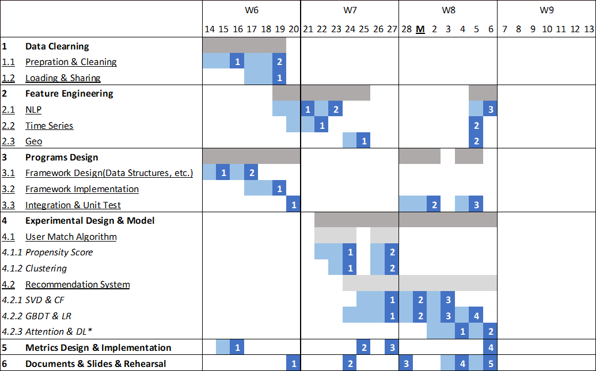
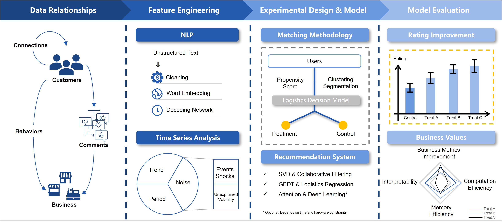

# MSCA31008-Data-Mining-Principles

This is the final project of MSCA31008, Data Mining Principles. In this project, we will implement a recommendation engine based on Yelp Dataset.

|Team Member|Role|Description|
|:---:|:-:|:-|
|[**Jason Lee**](https://github.com/jasonwlee1219)|Script|Note-taking for meetings
|[**Milan Toolsidas**](https://github.com/mtoolsidas)|Quality Control|Checking if we meet the criteria of the assignments, formatting the PowerPoints and reports|
|[**Minglun Pan**](https://github.com/MinglunPan)|Leader|Creating agendas for each meeting, making sure other roles’ expectations are meet|
|[**Norah Zhang**](https://github.com/norahz3)|Facilitator|Planning meetings, creating Zoom meetings when needed, making sure everyone’s involved, timekeeping|
|[**Ryan Liao**](https://github.com/Ryan47Liao)|Devil’s Advocate|Providing constructive critical opinions, observing team dynamics|

# Descriptions

The purpose of this project is to analyze factors on Yelp to predict the ratings users give businesses based on their comments and create a recommendation engine to understand users’ preferences. 

 - This project utilizes the Yelp dataset, which consists of five separate JSON files. The files include data regarding check-ins, tips, reviews, businesses, and users. The files contain both structured and unstructured data, with the latter being text.
 - The analysis will include predicting Yelp ratings by performing natural language processing (NLP) on reviews through sentiment analysis. This will require using NLP techniques such as word embedding methods and pre-trained encoding neural networks. We will be using the predicted Yelp ratings to help evaluate our model. 

# Objective

 - Understand users' preferences for different businesses and cluster them to create personalized recommendations. 

 - Understand the relationships between customers and businesses through customer comments and behaviors. 

# Timeline

# Workflow

## Dataset
 - The dataset is very large, so removing unnecessary and redundant features will help improve the performance of the model. 
 - Data tables are under the databse 'dmp_yelp_rs' in RCC Hadoop. 

## Feature Engineering

 - Utilize NLP techniques to perform feature engineering by cleaning the text of reviews and applying word embedding techniques and a decoding network.

- Execute a time series analysis to identify trends and noise. 

- Implement Geographical Analysis to figure out the geo-information.

## Modelling

1. Pass the users through a logistic regression decision model to assign them into the treatment or control groups. 

2. Build recommendation systems:
 + singular value decomposition(SVD) and collaborative filtering(CF)
 + xgBoost and potentially deep learning. 

## Evaluation

Use business values and model metrics to evaluate our model, which includes:

- Identify areas for businesses to improve.

- Optimizethe model's interpretability, computational efficiency, and memory efficiency.
